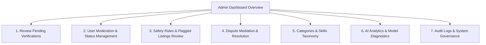

# FixTogether — Admin Activities & Platform Governance Architecture

This document provides a comprehensive analysis of all **activities, administrative controls, APIs, data models, and UI components** associated with the **Administrator** role in the FixTogether platform.

---

## 1. Overview & Admin Dashboard Metrics

The Administrator maintains platform security, user trust, regulatory safety compliance, verification approvals, category taxonomies, AI accuracy monitoring, and dispute resolution.

### Platform-Wide Governance Metrics (`GET /api/v1/admin/dashboard`)

| Dashboard Metric | Data Sources & Aggregations | Purpose |
| :--- | :--- | :--- |
| **Total Users by Role** | `User.countDocuments({ role: ... })` | Tracks breakdown of Owners, Technicians, Organizations, and Admins |
| **Pending Verifications** | `TechnicianProfile` & `OrganizationProfile` (status: `pending`) | Workload queue of unverified professionals/NGOs |
| **Active & Completed Repairs** | `RepairRequest` & `RepairJob` counts | Measures active platform repair throughput |
| **Completed Donations** | `DonationOffer.countDocuments({ status: 'completed' })` | Measures total charitable equipment donations |
| **Open Disputes** | `Dispute.countDocuments({ status: 'open' })` | Consumer protection tickets requiring immediate admin intervention |
| **Safety Flagged Listings** | `RepairRequest.countDocuments({ 'safetyFlags.0': { $exists: true } })` | Listings flagged with high-voltage, fire, or battery hazards |
| **AI Correction Rate** | `AIAnalysis.countDocuments({ 'ownerCorrections...': true })` | Percentage of AI diagnoses that required owner correction |
| **Total Impact Saved** | `ImpactRecord` aggregation | Total kilograms of waste diverted and money saved across the community |

---

## 2. Complete Administrator Governance Workflow

---

## 3. Detailed Functional Activities of an Administrator

### Activity Module 1: Professional & Organization Verifications (`/admin/verifications`)
* **Review Pending Technician Applications**:
  * Inspect uploaded trade licenses, national ID, workshop certifications, and self-reported skills.
  * *API*: `GET /api/v1/admin/technicians/pending`
* **Approve / Reject Technician Verification**:
  * Set status to `approved`, `rejected`, or `suspended` with verification review notes.
  * Triggers automatic notifications to the technician and logs an audit record.
  * *API*: `PATCH /api/v1/admin/technicians/:id/verification`
* **Review Pending NGO / Charity Applications**:
  * Inspect legal non-profit registrations, tax documents, physical hubs, and authorized contact persons.
  * *API*: `GET /api/v1/admin/organizations/pending`
* **Approve / Reject Organization Verification**:
  * *API*: `PATCH /api/v1/admin/organizations/:id/verification`

---

### Activity Module 2: User Moderation & Account Management (`/admin/users`)
* **List & Filter All Platform Users**:
  * Filter users by role (`owner`, `technician`, `organization`, `admin`), account status (`active`, `suspended`, `pending`), or search query.
  * *API*: `GET /api/v1/admin/users`
* **Moderate User Status (Suspend / Reactivate)**:
  * Temporarily or permanently suspend bad actors (e.g. fraudulent quotes, abusive behavior, safety violations) with a logged suspension reason.
  * *API*: `PATCH /api/v1/admin/users/:id/status`

---

### Activity Module 3: Safety Rules & Flagged Listings (`/admin/safety`)
* **Manage Safety Rules Engine**:
  * Create, update, and deactivate keyword and regex patterns that detect hazards (e.g. high-voltage capacitors, microwave magnetrons, swollen Li-ion batteries, chemical leaks).
  * Set rule severity (`critical`, `warning`, `info`) and category scope.
  * *API*: `GET /api/v1/admin/safety-rules`, `POST /api/v1/admin/safety-rules`, `PATCH /api/v1/admin/safety-rules/:id`, `DELETE /api/v1/admin/safety-rules/:id`
* **Review Flagged Listings**:
  * Inspect repair requests and items that triggered safety warnings during creation or AI scanning.
  * Actions: Dismiss false-positive flags or forcibly cancel hazardous listings.
  * *API*: `GET /api/v1/admin/flagged-listings`, `PATCH /api/v1/admin/flagged-listings/:id`

---

### Activity Module 4: Dispute Mediation & Resolution (`/admin/disputes`)
* **Review Escalated Disputes**:
  * Inspect customer complaints, technician responses, repair history, inspection reports, and photo evidence.
  * *API*: `GET /api/v1/disputes`
* **Resolve Disputes**:
  * Issue binding administrative resolutions (e.g. `refund_issued`, `repair_reopened`, `claim_denied`, `technician_cautioned`).
  * Update dispute status to `resolved` and record resolution terms.
  * *API*: `PATCH /api/v1/admin/disputes/:id/resolve`

---

### Activity Module 5: Platform Taxonomies (Categories & Skills)
* **Manage Item Categories**:
  * Create/update categories (e.g. Smartphones, Laptops, Microwaves, Power Tools).
  * Configure risk levels, icon names, prohibited AI advice rules, and default diagnostic questions.
  * *API*: `POST /api/v1/admin/categories`, `PATCH /api/v1/admin/categories/:id`, `DELETE /api/v1/admin/categories/:id`
* **Manage Standardized Skills**:
  * Add standardized skills (e.g. Micro-soldering, Motherboard Diagnostics, Motor Rewinding, Screen Replacement) used in technician profiles and matching algorithms.
  * *API*: `POST /api/v1/admin/skills`, `PATCH /api/v1/admin/skills/:id`

---

### Activity Module 6: AI Performance Analytics (`/admin/ai-analytics`)
* **Monitor AI Diagnosis Accuracy**:
  * Track total analyses run across AI providers (Gemini, OpenAI, Mock).
  * Measure average processing time (ms).
  * Track Owner Correction Rate (percentage of diagnoses where users manually corrected symptoms or categories).
  * *API*: `GET /api/v1/admin/ai-analytics`

---

### Activity Module 7: Platform Audit Logs & Impact Reporting (`/admin/audit-logs`, `/admin/impact`)
* **Audit Trail Inspection**:
  * View chronological logs of security-critical actions (`USER_REGISTERED`, `PASSWORD_CHANGED`, `USER_SUSPENDED`, `TECHNICIAN_VERIFICATION_UPDATED`, etc.) with actor ID, target entity, timestamp, and IP address.
  * *API*: `GET /api/v1/admin/audit-logs`
* **Aggregated Community Environmental Impact**:
  * View macro-level metrics: total waste avoided (kg), total replacement cost saved (৳), and outcome breakdowns.
  * *API*: `GET /api/v1/admin/impact`

---

## 4. Database Models Governed by Admin

| Model | Schema File | Admin Control / Action |
| :--- | :--- | :--- |
| **`SafetyRule`** | [`SafetyRule.js`](file:///d:/Projects/FixTogether/server/src/models/SafetyRule.js) | Defines keywords, regex patterns, and risk thresholds for hazardous devices |
| **`AuditLog`** | [`AuditLog.js`](file:///d:/Projects/FixTogether/server/src/models/AuditLog.js) | Immutable security log of administrative actions, status changes, and auth events |
| **`ItemCategory`** | [`ItemCategory.js`](file:///d:/Projects/FixTogether/server/src/models/ItemCategory.js) | System category tree, risk level classification, and mandatory diagnostic prompts |
| **`Skill`** | [`Skill.js`](file:///d:/Projects/FixTogether/server/src/models/Skill.js) | Canonical skills directory for matching algorithms |
| **`Dispute`** | [`Dispute.js`](file:///d:/Projects/FixTogether/server/src/models/Dispute.js) | Escalated repair conflicts requiring binding admin mediation |
| **`TechnicianProfile`** | [`TechnicianProfile.js`](file:///d:/Projects/FixTogether/server/src/models/TechnicianProfile.js) | Verification status transitions and compliance audits |
| **`OrganizationProfile`** | [`OrganizationProfile.js`](file:///d:/Projects/FixTogether/server/src/models/OrganizationProfile.js) | NGO accreditation and verification compliance |
| **`ImpactRecord`** | [`ImpactRecord.js`](file:///d:/Projects/FixTogether/server/src/models/ImpactRecord.js) | Platform-wide environmental and financial impact records |

---

## 5. Extension Opportunities for Future Updates

1. **Automated Fraud & Suspicious Quotation Detection**:
   * Flag quotations that deviate significantly from platform average market rates for a specific symptom.
2. **AI Provider Fallback & Load Switcher**:
   * UI toggle to switch live AI model providers (e.g. Gemini 3.1 Pro ↔ GPT-4o ↔ Mock) on the fly without server restart.
3. **Automated Verification Document OCR / Pre-Screening**:
   * AI-powered document extraction to verify trade license numbers and expiry dates automatically.
4. **Data Export & Compliance Reports**:
   * One-click CSV/PDF export of yearly community e-waste diversion reports for government environmental ministries.
