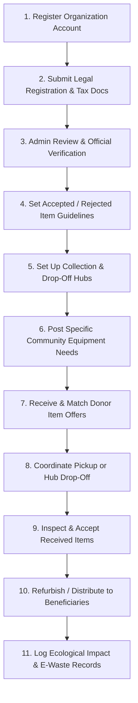

# FixTogether — Organization Activities & Lifecycle Architecture

This document provides a comprehensive analysis of all **activities, lifecycle states, APIs, data models, and UI components** associated with the **Organization** (NGO, Charity, Recycler, Community Center) role in the FixTogether platform.

---

## 1. Overview & Organization Profile / Dashboard

Organizations are non-profits, schools, community repair hubs, and certified recyclers who receive donated electronics/appliances, list specific equipment needs for beneficiaries, coordinate collection hubs, and track cumulative community environmental impact.

### Organization Key Stats (`GET /api/v1/users/me/stats`)

| Metric | Field in Profile / Database | Meaning |
| :--- | :--- | :--- |
| **Donations Received** | `OrganizationProfile.impactStats.totalDonationsReceived` | Total donation offers accepted and completed |
| **Items Processed** | `OrganizationProfile.impactStats.totalItemsProcessed` | Total items refurbished and redistributed to beneficiaries |
| **E-Waste Diverted (kg)** | `OrganizationProfile.impactStats.totalWeightProcessed` | Total kilograms of electronic waste kept out of landfills |

---

## 2. Complete Organization Lifecycle Workflow

---

## 3. Detailed Functional Activities of an Organization

### Activity Module 1: Profile, Compliance & Verification (`/profile`, `/organizations/me/profile`)
* **Organization Profile Management**:
  * Fields: Organization name, mission description, organization type (`donation_org`, `recycler`, `repair_cafe`, `educational_institute`), website, contact person details, service radius, operating hours.
  * *API*: `PUT /api/v1/organizations/me/profile`
* **Submit Verification Documents**:
  * Upload NGO registration certificates, tax exemption papers, authorization letters, and hub photos for admin accreditation.
  * *API*: `POST /api/v1/organizations/me/verification`
* **Configure Accepted & Rejected Categories**:
  * Define items accepted (e.g., working laptops, monitors, smartphones, audio equipment).
  * Explicitly flag rejected hazard categories (e.g. swollen batteries, biohazards, leaking CRT monitors).
  * Provide customized donation and recycling instructions for donors.
  * *API*: `PUT /api/v1/organizations/me/profile`
* **Manage Collection & Drop-off Locations**:
  * Register physical collection hubs, drop-off bins, and warehouse points with operating hours and instructions.
  * *API*: `PUT /api/v1/organizations/me/profile` (locations array)

---

### Activity Module 2: Community Needs & Wishlist (`/donations/needs`)
* **Post Equipment Needs (Wishlists)**:
  * Create specific needs for beneficiaries (e.g., *"10 Core-i5 Laptops for Digital Literacy Lab"* or *"5 Working Projectors for Community School"*).
  * Fields: Title, category, quantity needed, urgency level (`low`, `medium`, `urgent`), description, target date, beneficiary context.
  * *API*: `POST /api/v1/donations/needs`
* **Manage Active Needs**:
  * Update fulfillment quantities as donations arrive, edit requirements, or close fulfilled needs.
  * *API*: `PATCH /api/v1/donations/needs/:id`, `DELETE /api/v1/donations/needs/:id`
* **List Public Needs**:
  * Expose needs to community donors on the public donation board.
  * *API*: `GET /api/v1/donations/needs`

---

### Activity Module 3: Donation Processing & Logistics (`/donations`)
* **Browse & Review Incoming Donation Offers**:
  * View offers from community members matching the organization's accepted categories.
  * Review item condition, images, donor location, and delivery preference (donor drop-off vs. organization pickup).
  * *API*: `GET /api/v1/donations/offers`
* **Accept / Reject Donation Offer**:
  * Accept offer to initiate transfer coordination, or reject with a polite reason.
  * *API*: `PATCH /api/v1/donations/offers/:id/status`
* **Match Offer to Existing Need**:
  * Link an incoming donated item to a posted need ticket to track fulfillment progress.
  * *API*: `POST /api/v1/donations/offers/:id/match`
* **Confirm Handover & Receipt**:
  * Mark donation offer as `completed` upon physical delivery at a hub or pickup.
  * *API*: `PATCH /api/v1/donations/offers/:id/status` (`status: 'completed'`)

---

### Activity Module 4: Impact Tracking & E-Waste Records (`/impact`)
* **Log Redistribution & Refurbishment Outcomes**:
  * Record whether a received item was redistributed, refurbished, salvaged for parts, or responsibly recycled.
  * Log estimated weight (kg), avoided replacement value (৳), and beneficiary details.
  * *API*: Automatically linked to [`ImpactRecord`](file:///d:/Projects/FixTogether/server/src/models/ImpactRecord.js) creation upon donation completion.
* **Public Impact Showcase**:
  * Display verified impact metrics on the public organization profile ([`OrganizationDetailPage.jsx`](file:///d:/Projects/FixTogether/client/src/pages/donations/OrganizationDetailPage.jsx)) to encourage community trust and donations.
  * *API*: `GET /api/v1/organizations/:id`

---

## 4. Database Models Linked to Organization

| Model | Schema File | Role in Organization Workflow |
| :--- | :--- | :--- |
| **`OrganizationProfile`** | [`OrganizationProfile.js`](file:///d:/Projects/FixTogether/server/src/models/OrganizationProfile.js) | NGO credentials, registration docs, accepted/rejected categories, physical hubs, impact counters |
| **`DonationNeed`** | [`DonationNeed.js`](file:///d:/Projects/FixTogether/server/src/models/DonationNeed.js) | Equipment request tickets posted by the organization for community donors |
| **`DonationOffer`** | [`DonationOffer.js`](file:///d:/Projects/FixTogether/server/src/models/DonationOffer.js) | Community item offers targeted to or claimed by the organization |
| **`ImpactRecord`** | [`ImpactRecord.js`](file:///d:/Projects/FixTogether/server/src/models/ImpactRecord.js) | Log of weight saved, replacement cost saved, and redistribution outcomes |
| **`User`** | [`User.js`](file:///d:/Projects/FixTogether/server/src/models/User.js) | User account, security settings, and contact person credentials |
| **`Notification`** | [`Notification.js`](file:///d:/Projects/FixTogether/server/src/models/Notification.js) | In-app alerts for incoming donation offers and verification updates |

---

## 5. Extension Opportunities for Future Updates

1. **Beneficiary Distribution Log**:
   * Track direct beneficiary delivery receipts (e.g. school name, student ID, distribution event photo).
2. **E-Waste Recycling Manifests**:
   * Issue certified e-waste recycling certificates to corporate donors for ESG compliance.
3. **Pickup Logistics & Route Planner**:
   * Schedule multi-stop volunteer pickup runs for bulky electronics in urban areas.
4. **Community Donation Drives**:
   * Create time-limited donation events (e.g. *"Earth Day E-Waste Collection Drive 2026"*).
