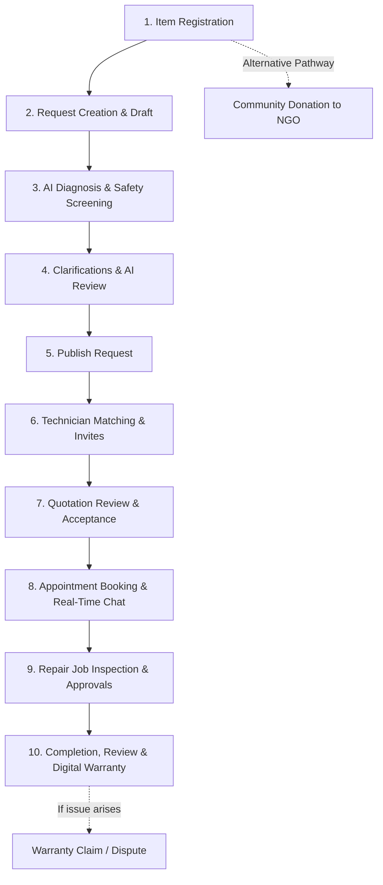

# FixTogether — Owner Activities & Lifecycle Architecture

This document provides a comprehensive analysis of all **activities, lifecycle states, APIs, data models, and UI components** associated with the **Owner** role in the FixTogether platform.

---

## 1. Overview & Activity Stream Feed

The platform tracks and aggregates real-time actions performed by an Owner. The activity feed is exposed via `GET /api/v1/users/me/activity` and rendered in the Owner Profile ([`ProfilePage.jsx`](file:///d:/Projects/FixTogether/client/src/pages/profile/ProfilePage.jsx)) and Dashboard ([`DashboardPage.jsx`](file:///d:/Projects/FixTogether/client/src/pages/dashboard/DashboardPage.jsx)).

### Current Feed Aggregations

| Event Identifier | Description / Trigger | Associated Model | Frontend Route |
| :--- | :--- | :--- | :--- |
| `ITEM_REGISTERED` | When an owner registers a new electronic or household item | [`Item`](file:///d:/Projects/FixTogether/server/src/models/Item.js) | `/items` |
| `REPAIR_REQUEST` | When an owner creates, modifies, or updates the status of a repair request | [`RepairRequest`](file:///d:/Projects/FixTogether/server/src/models/RepairRequest.js) | `/repair-requests/:id` |
| `DONATION` | When an owner offers an item for community donation to verified NGOs | [`DonationOffer`](file:///d:/Projects/FixTogether/server/src/models/DonationOffer.js) | `/donations` |

---

## 2. Complete Owner Lifecycle Workflow

---

## 3. Detailed Functional Activities of an Owner

### Activity Module 1: Item Inventory Management (`/items`)
* **Register Items**:
  * Fields: Title, category, brand, model number, serial number, condition (`working`, `needs_repair`, `broken`, `for_parts`), purchase date, estimated replacement value, photos, and notes.
  * *API*: `POST /api/v1/items`
* **Browse & Filter Items**:
  * Filter by category, condition, or search query.
  * *API*: `GET /api/v1/items`
* **View Item Details**:
  * *API*: `GET /api/v1/items/:id`
* **Edit Item Information**:
  * *API*: `PATCH /api/v1/items/:id`
* **Delete Item**:
  * *API*: `DELETE /api/v1/items/:id`

---

### Activity Module 2: Repair Request Lifecycle (`/repair-requests`)
* **Create Repair Draft**:
  * Select registered item, describe symptoms, onset time, preceding events, previous DIY attempts, budget range (min/max), and preferred service method (in-shop, home visit, courier).
  * *API*: `POST /api/v1/repair-requests`
* **Execute AI Fault Diagnosis & Safety Rules**:
  * Deterministic safety screening (blocks hazardous DIY advice if high voltage, swollen battery, fire hazard, or chemical leakage is detected).
  * Gemini AI generates: probable fault summary, repairability score (1–10), cost range estimate, required parts list, and clarification questions.
  * *API*: `POST /api/v1/repair-requests/:id/analyze`
* **Review AI Diagnostic Results**:
  * Correct AI findings (category, symptoms, notes) to feed back into AI analytics.
  * *API*: `PATCH /api/v1/repair-requests/:id/ai-review`
* **Submit Clarification Answers**:
  * Answer specific diagnostic questions generated by the AI model or category rules.
  * *API*: `POST /api/v1/repair-requests/:id/answers`
* **Publish Repair Request**:
  * Makes the request publicly discoverable to verified technicians and triggers matching algorithms.
  * Persists notifications for technicians/admins and emits real-time `repair-request:published` Socket.IO event.
  * *API*: `POST /api/v1/repair-requests/:id/publish`
* **Cancel Repair Request**:
  * *API*: `POST /api/v1/repair-requests/:id/cancel`

---

### Activity Module 3: Technician Matching, Quotations & Messaging
* **View Matched Technicians**:
  * Review compatibility score, distance, verified skills, rating, and repair count.
  * *API*: `GET /api/v1/repair-requests/:id/matches`
* **Send Quotation Invitations**:
  * Invite specific top-matched technicians to quote.
  * *API*: `POST /api/v1/repair-requests/:id/invitations`
* **Review Received Quotations**:
  * Compare inspection fees, labor costs, estimated parts costs, delivery times, and warranty offerings.
  * *API*: `GET /api/v1/repair-requests/:id/quotations`
* **Accept / Reject Quotations**:
  * Accepting locks in the technician and transitions the request into active repair job processing.
  * *API*: `POST /api/v1/quotations/:id/accept` / `POST /api/v1/quotations/:id/reject`
* **Direct Real-Time Chat**:
  * Live messaging with assigned technicians, real-time typing indicators, and read receipts.
  * *API*: `GET /api/v1/messages/:repairRequestId`, `POST /api/v1/messages/:repairRequestId`

---

### Activity Module 4: Appointments & Repair Job Approvals (`/repair-jobs`, `/appointments`)
* **Schedule Appointments**:
  * Select date/time slot and service method (drop-off, pickup, on-site).
  * *API*: `POST /api/v1/appointments`
* **Manage Appointments**:
  * Reschedule or cancel appointments.
  * *API*: `PATCH /api/v1/appointments/:id/status`
* **Track Repair Job Stages**:
  * Real-time status tracker: `pending_inspection` → `under_inspection` → `awaiting_owner_approval` → `waiting_for_parts` → `repair_in_progress` → `quality_check` → `ready_for_collection` → `completed`.
  * *API*: `GET /api/v1/repair-jobs/:id`
* **Approve / Decline Additional Costs**:
  * Review post-inspection diagnostic reports and approve revised parts/labor costs.
  * *API*: `POST /api/v1/repair-jobs/:id/owner-approval`
* **Confirm Repair Completion & Handover**:
  * Verify repaired item functionality and confirm receipt.
  * *API*: `POST /api/v1/repair-jobs/:id/complete`

---

### Activity Module 5: Reviews, Warranties & Disputes
* **Submit Technician Review & Rating**:
  * Rate technician across punctuality, workmanship, communication, and overall satisfaction (1–5 stars with written feedback).
  * *API*: `POST /api/v1/reviews`
* **View Active Warranties**:
  * Track active digital warranties issued by technicians on replaced parts and service labor.
  * *API*: `GET /api/v1/warranties`
* **File Warranty Claims**:
  * Submit warranty claim if the item malfunctions within the warranty period.
  * *API*: `POST /api/v1/warranty-claims`
* **Open & Manage Disputes**:
  * Escalate unresolved issues to platform admins with supporting evidence/photos.
  * *API*: `POST /api/v1/disputes`

---

### Activity Module 6: Community Donations & Circular Economy (`/donations`)
* **Create Donation Offer**:
  * List working or repairable items for community donation.
  * *API*: `POST /api/v1/donations/offers`
* **Browse NGO Donation Needs**:
  * View specific items requested by verified non-profits, schools, or charities.
  * *API*: `GET /api/v1/donations/needs`
* **Match & Handover Donation**:
  * Assign item to organization and confirm handover.
  * *API*: `PATCH /api/v1/donations/offers/:id/status`

---

### Activity Module 7: AI Troubleshooting Assistant (`/ai/chat`)
* **Interactive AI Assistant**:
  * Floating AI helper for instant questions, fault diagnosis, maintenance tips, and safe disposal advice.
  * *API*: `POST /api/v1/ai/chat`

---

### Activity Module 8: Profile, Security & Preferences (`/users/me`)
* **Profile Management**: Update full name, phone number, address/city, bio, and avatar.
* **Privacy Controls**: Toggle visibility of phone, email, and location.
* **Notification Preferences**: Configure email, SMS, and in-app alerts.
* **Password Management**: Change password and invalidate active sessions.

---

## 4. Database Models Linked to Owner

| Model | Schema File | Role in Owner Workflow |
| :--- | :--- | :--- |
| **`User`** | [`User.js`](file:///d:/Projects/FixTogether/server/src/models/User.js) | Stores owner credentials, contact details, profile image, notification & privacy settings |
| **`Item`** | [`Item.js`](file:///d:/Projects/FixTogether/server/src/models/Item.js) | Inventory of items owned by the user with condition and valuation |
| **`RepairRequest`** | [`RepairRequest.js`](file:///d:/Projects/FixTogether/server/src/models/RepairRequest.js) | Full repair request state machine, problem descriptions, budget, and assignments |
| **`AIAnalysis`** | [`AIAnalysis.js`](file:///d:/Projects/FixTogether/server/src/models/AIAnalysis.js) | AI fault predictions, safety flags, and owner correction audit trail |
| **`TechnicianMatch`**| [`TechnicianMatch.js`](file:///d:/Projects/FixTogether/server/src/models/TechnicianMatch.js) | Algorithm match scores and invitation statuses |
| **`Quotation`** | [`Quotation.js`](file:///d:/Projects/FixTogether/server/src/models/Quotation.js) | Pricing proposals submitted by technicians to the owner |
| **`Appointment`** | [`Appointment.js`](file:///d:/Projects/FixTogether/server/src/models/Appointment.js) | Scheduled repair/drop-off time slots |
| **`RepairJob`** | [`RepairJob.js`](file:///d:/Projects/FixTogether/server/src/models/RepairJob.js) | Active repair execution, status transitions, parts, and approvals |
| **`DonationOffer`** | [`DonationOffer.js`](file:///d:/Projects/FixTogether/server/src/models/DonationOffer.js) | Items listed by the owner for non-profit donation |
| **`Review`** | [`Review.js`](file:///d:/Projects/FixTogether/server/src/models/Review.js) | Ratings and reviews left by the owner for technicians |
| **`Warranty`** | [`Warranty.js`](file:///d:/Projects/FixTogether/server/src/models/Warranty.js) | Active warranty terms tied to completed repair jobs |
| **`Dispute`** | [`Dispute.js`](file:///d:/Projects/FixTogether/server/src/models/Dispute.js) | Conflict resolution tickets filed by the owner |
| **`Message`** | [`Message.js`](file:///d:/Projects/FixTogether/server/src/models/Message.js) | Direct chat messages between owner and technician |
| **`Notification`** | [`Notification.js`](file:///d:/Projects/FixTogether/server/src/models/Notification.js) | In-app alerts for quote arrivals, status changes, and messages |

---

## 5. Extension Opportunities for Future Updates

If you wish to analyze or expand Owner capabilities later, here are key enhancement opportunities:

1. **Enriched Activity Stream Events**:
   * Extend `getMyActivity` in [`userController.js`](file:///d:/Projects/FixTogether/server/src/controllers/userController.js) to also record:
     * `QUOTATION_ACCEPTED` (when an owner accepts a quote)
     * `APPOINTMENT_CONFIRMED` (when an appointment is booked)
     * `REPAIR_COMPLETED` (when repair verification is confirmed)
     * `REVIEW_POSTED` (when feedback is given)
     * `DONATION_COMPLETED` (when non-profit confirms receipt)
2. **Owner Sustainability & Impact Dashboard**:
   * Display cumulative metrics on the Owner Dashboard:
     * Total cost saved (Replacement value minus repair expense)
     * Total e-waste diverted (in kg)
     * Carbon footprint reduction estimate
3. **Automated Maintenance Reminders**:
   * Routine maintenance reminders for registered items (e.g. laptop thermal paste check, appliance cleaning, filter replacements).
4. **Digital Repair Passport / Invoice Export**:
   * Export PDF history of an item's complete repair and maintenance records.
