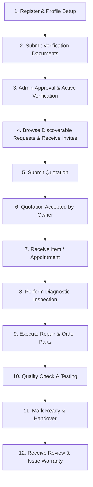

# FixTogether — Technician Activities & Lifecycle Architecture

This document provides a comprehensive analysis of all **activities, lifecycle states, APIs, data models, and UI components** associated with the **Technician** role in the FixTogether platform.

---

## 1. Overview & Technician Profile / Dashboard

The Technician is a service provider on FixTogether who inspects, quotes, repairs, and issues warranties on consumer electronics and household items. Technicians have access to specialized dashboard metrics, a quotation engine, job tracking workflows, and a public/private portfolio showcase.

### Technician Key Stats (`GET /api/v1/users/me/stats`)

| Metric | Field in Profile / Database | Meaning |
| :--- | :--- | :--- |
| **Completed Repairs** | `TechnicianProfile.completedRepairCount` | Total number of successfully completed repair jobs |
| **Average Rating** | `TechnicianProfile.averageRating` | Star rating average (1.0 - 5.0) from verified customer reviews |
| **Review Count** | `TechnicianProfile.reviewCount` | Total verified customer reviews received |
| **Completion Rate** | `TechnicianProfile.completionRate` | Percentage of started jobs successfully resolved |
| **Availability Status** | `TechnicianProfile.availabilityStatus` | `available` (green), `busy` (yellow), or `unavailable` (red) |

---

## 2. Complete Technician Lifecycle Workflow

---

## 3. Detailed Functional Activities of a Technician

### Activity Module 1: Profile, Skills & Verification (`/profile`, `/technicians/me/profile`)
* **Professional Profile Setup**:
  * Fields: Professional name, biography, supported item categories, skills/expertise, years of experience, languages, minimum inspection charge, service radius (km), service methods (drop-off, pickup, on-site), warranty terms.
  * *API*: `PUT /api/v1/technicians/me/profile`
* **Quick Availability Toggle**:
  * Switch between `available`, `busy`, and `unavailable`.
  * *API*: `PATCH /api/v1/technicians/me/availability`
* **Upload Verification Documents**:
  * Upload trade licenses, certifications, government ID, or workshop proof for admin review.
  * *API*: `POST /api/v1/technicians/me/verification`
* **Manage Portfolio Showcase**:
  * Upload before-and-after photos, problem description, category, and completion date to display verified workmanship on the public profile.
  * *API*: `POST /api/v1/technicians/me/portfolio`, `DELETE /api/v1/technicians/me/portfolio/:itemId`

---

### Activity Module 2: Discovering & Quoting on Repair Requests (`/repair-requests`)
* **Browse Available Requests Wall**:
  * View published repair requests filtered by category, issue severity, or location (drafts are strictly hidden).
  * Real-time updates via `repair-request:published` Socket.IO events.
  * *API*: `GET /api/v1/repair-requests`
* **View Request Details & AI Diagnostics**:
  * Access customer's item details, symptoms, and AI fault diagnosis findings.
  * *API*: `GET /api/v1/repair-requests/:id`
* **Submit Detailed Quotation**:
  * Provide breakdown: labor cost, estimated parts cost, estimated turnaround time (days), warranty period (days), service method, inspection fee, and technical notes.
  * *API*: `POST /api/v1/repair-requests/:id/quotations`
* **Withdraw / Update Quotation**:
  * Modify quote prior to owner acceptance or withdraw proposal.
  * *API*: `PATCH /api/v1/quotations/:id`, `POST /api/v1/quotations/:id/withdraw`

---

### Activity Module 3: Active Repair Job Management (`/repair-jobs`)
Once an owner accepts the quotation, an active `RepairJob` is created.

* **List Active Jobs**:
  * Filter jobs by stage: `pending_inspection`, `under_inspection`, `awaiting_owner_approval`, `waiting_for_parts`, `in_progress`, `quality_check`, `ready_for_collection`, `completed`.
  * *API*: `GET /api/v1/repair-jobs`
* **Record Diagnostic Inspection Findings**:
  * Log actual diagnostic findings, root cause, confirmed parts required, and if unexpected repair costs are needed.
  * *API*: `POST /api/v1/repair-jobs/:id/inspection`
* **Request Owner Approval for Additional Costs**:
  * If new issues/parts are uncovered during disassembly, request owner authorization before proceeding.
  * *API*: `POST /api/v1/repair-jobs/:id/request-approval`
* **Track Parts & Inventory**:
  * Log required replacement parts, part numbers, cost, sourcing status, and supplier info.
  * *API*: `POST /api/v1/repair-jobs/:id/parts`
* **Update Repair Stage**:
  * Progress job through lifecycle status transitions with internal notes and status history logs.
  * *API*: `PATCH /api/v1/repair-jobs/:id/status`
* **Quality Check & Complete Repair**:
  * Complete final testing checklist, upload post-repair photos, and mark `ready_for_collection`.
  * *API*: `POST /api/v1/repair-jobs/:id/complete`

---

### Activity Module 4: Appointments, Customer Communication & Warranties
* **Appointment Coordination**:
  * View booked customer drop-offs, home visits, or pickups.
  * Update appointment status (`confirmed`, `in_progress`, `completed`, `cancelled`, `rescheduled`).
  * *API*: `GET /api/v1/appointments`, `PATCH /api/v1/appointments/:id/status`
* **Direct Real-Time Chat with Owners**:
  * Communicate directly inside the repair ticket, send progress updates, share photos of broken parts.
  * *API*: `GET /api/v1/messages/:repairRequestId`, `POST /api/v1/messages/:repairRequestId`
* **Digital Warranty Management**:
  * Automatically creates a digital warranty tied to the completed repair job.
  * Review warranty claims submitted by customers and process resolution.
  * *API*: `GET /api/v1/warranties`, `PATCH /api/v1/warranty-claims/:id/resolve`
* **Customer Reviews & Reputation**:
  * View customer feedback, star ratings, and review metrics.
  * *API*: `GET /api/v1/technicians/:id/reviews`

---

## 4. Database Models Linked to Technician

| Model | Schema File | Role in Technician Workflow |
| :--- | :--- | :--- |
| **`TechnicianProfile`** | [`TechnicianProfile.js`](file:///d:/Projects/FixTogether/server/src/models/TechnicianProfile.js) | Professional details, verification documents, skills, pricing, portfolio, rating, and metrics |
| **`Skill`** | [`Skill.js`](file:///d:/Projects/FixTogether/server/src/models/Skill.js) | Standardized repair skills associated with the technician profile |
| **`TechnicianMatch`** | [`TechnicianMatch.js`](file:///d:/Projects/FixTogether/server/src/models/TechnicianMatch.js) | Algorithm matching records and invitation states |
| **`Quotation`** | [`Quotation.js`](file:///d:/Projects/FixTogether/server/src/models/Quotation.js) | Proposals submitted by the technician with pricing and warranty terms |
| **`Inspection`** | [`Inspection.js`](file:///d:/Projects/FixTogether/server/src/models/Inspection.js) | Technical diagnostics report, root cause analysis, and safety findings |
| **`RepairJob`** | [`RepairJob.js`](file:///d:/Projects/FixTogether/server/src/models/RepairJob.js) | Active repair tracking, status transitions, and progress history |
| **`RepairStatusHistory`** | [`RepairStatusHistory.js`](file:///d:/Projects/FixTogether/server/src/models/RepairStatusHistory.js) | Audit trail of every status transition with technician notes |
| **`Part`** | [`Part.js`](file:///d:/Projects/FixTogether/server/src/models/Part.js) | Replacement components tracked per repair job |
| **`Warranty`** | [`Warranty.js`](file:///d:/Projects/FixTogether/server/src/models/Warranty.js) | Active warranty terms issued to the owner |
| **`Review`** | [`Review.js`](file:///d:/Projects/FixTogether/server/src/models/Review.js) | Customer reviews received by the technician |
| **`Message`** | [`Message.js`](file:///d:/Projects/FixTogether/server/src/models/Message.js) | Customer chat messages and status discussions |

---

## 5. Extension Opportunities for Future Updates

1. **Technician Earnings & Financial Analytics**:
   * Dashboard charts for weekly/monthly revenue, completed labor, parts expenditure, and average ticket size.
2. **Technician Parts Inventory Management**:
   * A dedicated warehouse/shelf parts inventory tracker for spare components.
3. **Automated Diagnostic Checklists**:
   * Category-specific inspection checklists (e.g. smartphone display test, laptop power rail voltage test, microwave magnetron check).
4. **Certificate / Badge Generator**:
   * Verified badge tiers (e.g., Master Technician, Certified Eco-Repairer) displayed on public profiles.
